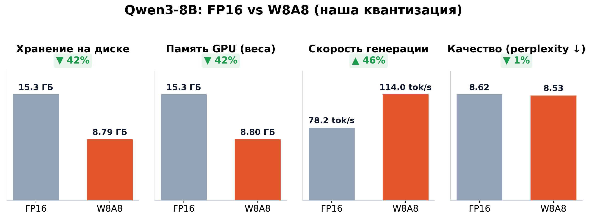

# Отчёт: эффективное хранение больших моделей через квантизацию

Сценарий: берём модель → квантуем веса → сохраняем сжатую → загружаем и
инферим → поднимаем по OpenAI-совместимому эндпоинту → платформа (self-service)
работает с ней как с обычной моделью.

## 1. Результаты

Модель: **Qwen3-8B**. Квантизация: **W8A8** (SmoothQuant + GPTQ, INT8 веса и
активации) через [`llm-compressor`](https://github.com/vllm-project/llm-compressor),
формат `compressed-tensors` — vLLM загружает напрямую.

| | FP16 (оригинал) | W8A8 (квантованная) | Δ |
|---|---|---|---|
| Размер на диске | 15.26 ГиБ | **8.79 ГиБ** | **−42%** |
| Память GPU (веса) | 15.27 ГиБ | **8.80 ГиБ** | **−42%** |
| Скорость генерации (vLLM, H200) | 78.2 tok/s | **114.0 tok/s** | **+46%** |
| Perplexity (WikiText-2) | 8.622 | **8.533** | качество сохранено |



Методика измерений (что и как мерили):
- **Диск**: размер safetensors-чекпоинта, единый источник для обеих моделей —
  лог загрузчика vLLM (`Checkpoint size`).
- **Память GPU**: лог vLLM `Model loading took X GiB` (только веса, без KV-кэша).
- **Скорость**: single-request greedy decode, 256 токенов, 3 прогона после
  прогрева, один и тот же скрипт (`scripts/bench_endpoint.py`) и одна версия
  vLLM. FP16 и W8A8 работали на разных физических GPU одного типа (NVIDIA
  H200); под батчевой нагрузкой соотношение может отличаться.
- **Качество**: perplexity на WikiText-2, одинаковый код и окно для обеих
  моделей, через transformers (от движка не зависит). Разница 8.622 vs 8.533
  в пределах шума калибровки: вывод — качество сохранено, а не «улучшено».
- Скорость и память квантованной модели принципиально измерять под **vLLM**:
  у HF transformers нет быстрых INT8-ядер, он распаковывает веса в FP16 и
  искажает обе метрики.

Конфигурация замеров: `results/run_config.json`, сырые отчёты:
`results/compare_vllm.json`.

## 2. Как воспроизвести

```bash
uv venv && uv pip install -e .            # окружение квантизации
uv venv .venv-vllm && uv pip install --python .venv-vllm vllm  # окружение сервинга

# полный прогон: метрики FP16 -> квантизация -> метрики W8A8 -> таблица
scripts/run_compare.sh configs/qwen3-8b-w8a8.json

# графики из результатов
python src/a2_kvant/plot.py --compare results/compare_vllm.json \
    --out results/comparison.png --title "Qwen3-8B: FP16 vs W8A8 (vLLM)"
```

Код квантизации: `src/a2_kvant/quantize.py` (oneshot-пайплайн) и
`src/a2_kvant/recipes.py` (реестр рецептов: `w8a8`, `w4a16`, `fp8` — рецепт
выбирается полем `quant.recipe` в JSON-конфиге).

## 3. Выбор модели при сервинге: квантованная или оригинал

```bash
scripts/serve_model.sh w8a8    # квантованная  -> http://<host>:8011/v1, модель qwen3-8b-w8a8
scripts/serve_model.sh fp16    # оригинальная  -> модель qwen3-8b-fp16
```

Эндпоинт OpenAI-совместимый, защищён API-ключом (генерируется в `.api_key`).
Проверка:

```python
from openai import OpenAI
client = OpenAI(base_url="http://<host>:8011/v1", api_key="<KEY>")
r = client.chat.completions.create(model="qwen3-8b-w8a8",
    messages=[{"role": "user", "content": "Привет!"}], max_tokens=100)
print(r.choices[0].message.content)
```

Альтернатива через Docker: `docker/docker-compose.yml` (образ
`vllm/vllm-openai`, чекпоинт пробрасывается volume-ом, параметры в `.env`).

## 4. Интеграция с платформой (self-service)

Проверено на развёрнутом [deeppavlov/self-service]: в `secrets/llm.env`
указывается адрес нашего vLLM и имя модели:

```bash
LLM_API_KEY="<KEY>"
LLM_BASE_URL="http://<vllm-host>:8011/v1"   # из docker-сети платформы: gateway, напр. http://172.20.0.1:8011/v1
LLM_MODEL_NAME="qwen3-8b-w8a8"              # или qwen3-8b-fp16 — выбор модели
OVERRIDE_MODEL_NAME="qwen3-8b-w8a8"
```

После `docker compose up --build` ассистент платформы отвечает через
квантованную модель (проверено по логам vLLM: запросы приходят с IP контейнера
ассистента). Переключение на оригинал = поменять `LLM_MODEL_NAME` и адрес/порт
на FP16-инстанс и пересобрать backend.

Практические замечания по развёртыванию:
- секреты копируются в образ backend при сборке — после смены `llm.env` нужны
  пересборка backend и удаление `tmp-*` образов ассистентов;
- из docker-сети платформы хост доступен по gateway сети
  (`docker network inspect <net> --format '{{(index .IPAM.Config 0).Gateway}}'`),
  а не по внешнему IP.

## 5. Структура репозитория

```
configs/          JSON-конфиги прогонов (модель, рецепт, калибровка, eval)
src/a2_kvant/     quantize ⭐ / recipes ⭐ / evaluate / metrics / plot / cli / serve_client
scripts/          run_compare.sh, serve_model.sh (выбор w8a8|fp16), bench_endpoint.py
docker/           docker-compose для vLLM OpenAI-эндпоинта
results/          таблицы, JSON-отчёты, comparison.png
```

Главные файлы квантизации: **`src/a2_kvant/quantize.py`** (пайплайн
загрузка → калибровка → квантизация → сохранение) и
**`src/a2_kvant/recipes.py`** (рецепты `w8a8` / `w4a16` / `fp8`).
